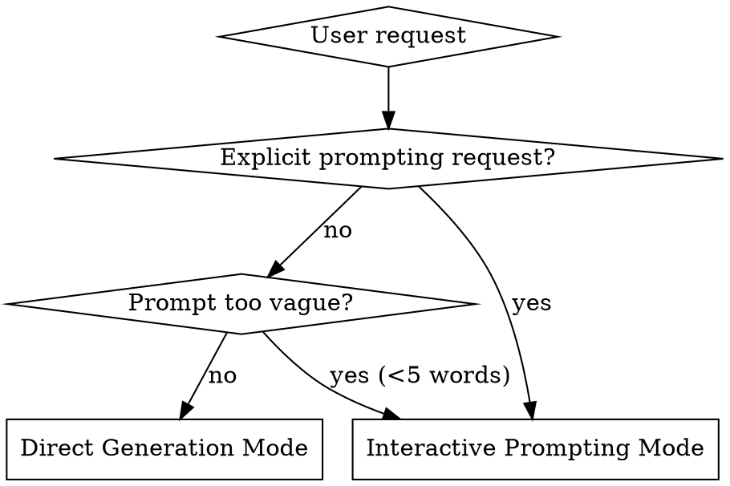
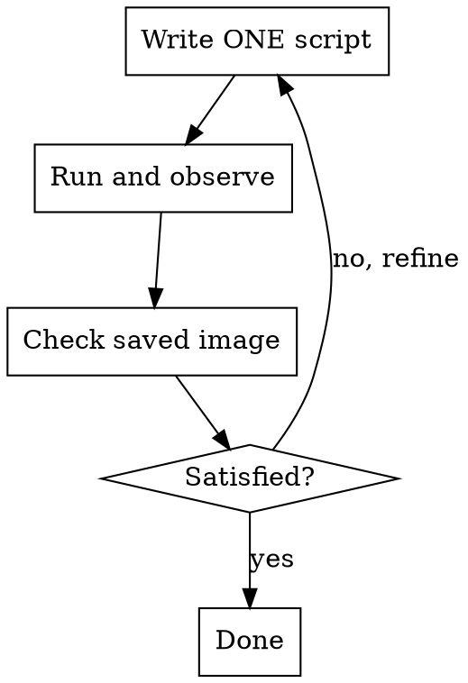
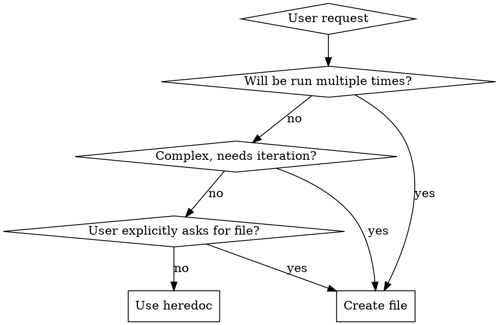

# Nano Banana

Quick Python scripting with Gemini image generation using uv heredocs. **No files needed for one-off tasks.**

Supports two modes:
- **Direct Generation**: Run immediately with user's prompt
- **Interactive Prompting**: Guide user through prompt design with proven techniques

## When to Use



**Use this skill when:**
- User requests image generation ("draw", "create", "generate image")
- User wants to create slides, presentations, or infographics
- User wants to edit existing images with AI
- User asks for prompt help ("write a prompt", "help me craft", "improve my prompt")
- User mentions brand style ("use style trend", "with trend colors")
- User mentions NotebookLM-style slides or specific visual styles
- User needs quick Python scripts with uv

**Don't use when:**
- User wants to analyze images (use vision models)
- User needs persistent/reusable scripts (then create files)
- User wants non-Gemini Python tasks

## Style Detection

Check user's message for style specifications:

**Structured syntax:**
- `style: "trend"` → Trend Micro brand colors
- `style: "notebooklm"` or `style: "slide"` → NotebookLM presentation style (MUST apply visual characteristics)
- `style: "custom"` → Ask for custom color preferences

**Natural language:**
- "use style trend" → Apply Trend Micro brand
- "with trend colors" → Apply Trend Micro brand
- "notebooklm style" or "create slide" or "presentation style" → NotebookLM aesthetic (MUST apply)
- "custom style: blue #0066cc" → Parse custom colors

**⚠️ CRITICAL for NotebookLM**: When detected, apply the style characteristics (see Brand Style Integration section). **NEVER include "NotebookLM" brand/logo/name in the Gemini prompt or generated slides** - this violates trademark policies. `notebooklm` is a **style trigger** for Claude only - translate to descriptive terms like "clean professional presentation aesthetic" in the actual prompt.

**Style detection precedence by mode:**

| Mode | User Provides Style? | Action |
|------|---------------------|--------|
| **Direct Generation** | Yes (inline spec) | Use detected style immediately |
| **Direct Generation** | No | Generate with no style (default) |
| **Interactive Prompting** | Yes (inline spec) | Use detected style, skip style question |
| **Interactive Prompting** | No | Ask user about style preference in Step 2 |

**Priority order (first match wins):**
1. Inline specification detected → Use it
2. Interactive Mode without inline spec → Ask user
3. Direct Mode without inline spec → No style (default)

## Quick Reference

### Direct Generation Mode

| Task | Pattern |
|------|---------|
| Generate image | `uv run - << 'EOF'` with inline script |
| Edit image | Same, but `contents=[prompt, img]` |
| Complex workflow | Multiple small scripts, evaluate between |
| Model choice | If `NANO_BANANA_MODEL` set → use it (don't override). If not set → Claude chooses based on requirements |
| Output format | Default: `webp`, or `NANO_BANANA_FORMAT` env var (webp/jpg/png) |
| Output location | `NNN-short-name/` (e.g., `001-cute-banana/`) |

### Interactive Prompting Mode

| Step | Action |
|------|--------|
| 1. Gather | Check for reference images, style specs |
| 2. Clarify | Ask 2-4 questions about output type, subject, style |
| 3. Select Technique | Choose from 16+ patterns (see references/guide.md) |
| 4. Generate Prompt | Apply technique, brand style, aspect ratio |
| 5. Present | Show prompt with explanation and variations |
| 6. Execute | Generate image with crafted prompt |

## Mode Selection

**Enter Interactive Prompting Mode when:**
- User explicitly requests: "help me write a prompt", "craft a better prompt"
- Prompt is too vague: <5 words, missing key details
- User says "improve this prompt: ..."

**Use Direct Generation Mode when:**
- User provides detailed prompt (>5 words with specifics)
- User just wants quick generation: "draw a cat"
- Prompt already includes style specs

## Direct Generation Mode

### Core Pattern: Heredoc Scripts

**Default to heredoc for one-off tasks:**

```bash
uv run - << 'EOF'
# /// script
# dependencies = ["google-genai", "pillow"]
# ///
import os
import io
from pathlib import Path
from google import genai
from google.genai import types
from PIL import Image as PILImage

# Directory selection logic
# Claude decides based on conversation context and user intent:
# - Continuation of existing work → Specify existing directory
# - New unrelated topic → Use auto-increment
# - Uncertain → Ask user with AskUserQuestion

# Option 1: Reuse existing directory (for continuation)
# OUTPUT_DIR = Path("001-existing-topic")  # Manually specify

# Option 2: Auto-increment for new topic (default)
existing_folders = sorted([d for d in Path(".").iterdir()
                          if d.is_dir() and len(d.name) >= 4
                          and d.name[:3].isdigit() and d.name[3] == '-'])
if existing_folders:
    last_num = int(existing_folders[-1].name[:3])
    next_num = last_num + 1
else:
    next_num = 1

OUTPUT_DIR = Path(f"{next_num:03d}-cute-banana")  # Format: NNN-short-name

OUTPUT_DIR.mkdir(exist_ok=True)
print(f"Using output directory: {OUTPUT_DIR}")

# Configuration from environment variables
# IMPORTANT: If NANO_BANANA_MODEL is set, use it - DO NOT override
model = os.environ.get("NANO_BANANA_MODEL")
if not model:
    # Only choose model when NANO_BANANA_MODEL is not set
    # Claude decides based on user request:
    # - Use "gemini-2.5-flash-image" ONLY if user explicitly mentions speed/budget
    # - Use "gemini-3-pro-image-preview" (default) for quality, slides, or normal requests
    model = "gemini-3-pro-image-preview"  # Replace with appropriate choice

output_format = os.environ.get("NANO_BANANA_FORMAT", "webp").lower()
quality = int(os.environ.get("NANO_BANANA_QUALITY", "90"))

# Detect if lossless format is needed (for diagrams/slides)
# See "Lossless WebP Decision Logic" in Configuration section for complete rules
use_lossless = False  # Set to True for slide deck styles or explicit user request

# Initialize client with optional custom endpoint
base_url = os.environ.get("GOOGLE_GEMINI_BASE_URL")
api_key = os.environ.get("GEMINI_API_KEY") or os.environ.get("GOOGLE_API_KEY")

if not api_key:
    print("Error: GEMINI_API_KEY or GOOGLE_API_KEY environment variable not set")
    exit(1)

try:
    if base_url:
        client = genai.Client(api_key=api_key, http_options={'base_url': base_url})
    else:
        client = genai.Client(api_key=api_key)

    config_params = {
        'response_modalities': ['IMAGE']
    }

    response = client.models.generate_content(
        model=model,
        contents=["A cute banana character with sunglasses"],
        config=types.GenerateContentConfig(**config_params)
    )

    if not response.parts:
        print("Error: No image generated in response")
        exit(1)

except Exception as e:
    print(f"Error during image generation: {e}")
    exit(1)

for part in response.parts:
    if part.inline_data is not None:
        # Get google-genai Image object
        genai_image = part.as_image()

        # Convert to PIL Image from bytes
        pil_image = PILImage.open(io.BytesIO(genai_image.image_bytes))

        # Save with format conversion
        if output_format in ("jpg", "jpeg"):
            output_path = OUTPUT_DIR / "generated.jpg"
            pil_image.convert("RGB").save(output_path, "JPEG", quality=quality)
        elif output_format == "webp":
            output_path = OUTPUT_DIR / "generated.webp"
            if use_lossless:
                # Lossless WebP for slide decks (VP8L encoding)
                # Saves 20-30% vs PNG, zero quality loss (vs lossy: saves 95% but blurs)
                pil_image.save(output_path, "WEBP", lossless=True)
                print(f"Saved: {output_path} (WEBP lossless, optimized for slides)")
            else:
                # Lossy WebP for photos (VP8 encoding)
                pil_image.save(output_path, "WEBP", quality=quality)
                print(f"Saved: {output_path} (WEBP, quality={quality})")
        else:  # png (default fallback)
            output_path = OUTPUT_DIR / "generated.png"
            pil_image.save(output_path, "PNG")
            print(f"Saved: {output_path} (PNG)")
EOF
```

**Key points:**
- Use `google-genai` (NOT `google-generativeai`)
- Inline script metadata: `# /// script` block
- Required deps: `google-genai`, `pillow` (for `.as_image()` to get image bytes, then convert to PIL for saving)

### Output Directory Naming

Save images to numbered directories:

**Format:** `NNN-short-name/`
- **NNN**: Three-digit zero-padded sequence (001, 002, 003...)
- **short-name**: kebab-case, 2-4 words from user request

**Directory selection - Intent-based decision:**

Claude determines whether this is a **continuation** of existing work or a **new topic** based on conversation context:

**Continuation (reuse existing directory):**
- User is adding to, editing, or extending previous generation
- The request relates to content already created in this session
- User wants variations or modifications of existing work
- **Action**: Specify the existing directory directly: `OUTPUT_DIR = Path("001-existing-topic")`

**New topic (auto-increment new directory):**
- User is starting something unrelated to previous work
- No prior context or different subject matter
- **Action**: Use auto-increment logic to scan for existing directories and create next numbered one

**When uncertain:**
- Use `AskUserQuestion` to clarify: "Should I add this to the existing [topic] directory, or create a new one?"

**Examples:**

```python
# Example 1: New topic (auto-increment)
# User: "Generate user auth flow"
# → No existing context, creates: 001-user-auth-flow/

# Example 2: Continuation (reuse directory)
# Existing: 001-user-auth-flow/ with login.webp
# User: "Add a signup screen too"
# Claude understands: This is continuation of auth flow topic
# → Reuse: OUTPUT_DIR = Path("001-user-auth-flow")
# → Saves: 001-user-auth-flow/signup.webp

# Example 3: New topic (auto-increment)
# Existing: 001-user-auth-flow/
# User: "Create cute cat illustration"
# Claude understands: Different topic, not related to auth
# → Scans, finds 001, creates: 002-cute-cat/

# Example 4: Uncertain (ask user)
# Existing: 001-japan-trip/ with cover.webp, overview.webp
# User: "Generate a travel conclusion"
# Claude uncertain: Could be for japan-trip or new generic travel content
# → Ask: "Should I add this to the existing japan-trip directory, or create a new one?"
```

### Configuration

Customize plugin behavior with environment variables:

| Variable | Default | Description |
|----------|---------|-------------|
| `NANO_BANANA_MODEL` | (Claude chooses) | Specify image generation model. If set, Claude will NOT override it. Valid models: `gemini-3-pro-image-preview` (quality), `gemini-2.5-flash-image` (speed) |
| `NANO_BANANA_FORMAT` | `webp` | Output format: `webp`, `jpg`, or `png` |
| `NANO_BANANA_QUALITY` | `90` | Image quality (1-100) for webp/jpg |
| `GOOGLE_GEMINI_BASE_URL` | (official API) | Custom API endpoint (for non-official deployments) |
| `GEMINI_API_KEY` | (falls back to `GOOGLE_API_KEY`) | API key (official or custom endpoint) |

**Model Selection Guidelines:**

When `NANO_BANANA_MODEL` is NOT set, Claude selects model based on user requirements:
- **Default**: `gemini-3-pro-image-preview` - Best quality, accurate colors, good text rendering (recommended for slides)
- **Speed/Budget**: `gemini-2.5-flash-image` - Faster generation, lower cost (ONLY when user explicitly requests speed/budget)

**IMPORTANT**: These are IMAGE generation models from the `gemini-image` API series. Do NOT use text generation models like `gemini-2.0-flash-exp`, `gemini-exp-1206`, or `gemini-2.0-flash-thinking-exp-*` - they are incompatible with image generation.

**Lossless WebP Decision Logic:**

When generating images, set `use_lossless` based on this priority order:

```python
# Apply rules in this exact order (first match wins):
if "style: trend" in user_message or "style: notebooklm" in user_message:
    use_lossless = True  # Slide deck styles with text/icons
elif user explicitly requests lossless/highest quality (understand intent in ANY language):
    use_lossless = True  # Examples: "lossless", "highest quality", "perfect quality", "for printing"
elif user explicitly requests lossy/smaller file (understand intent in ANY language):
    use_lossless = False  # Examples: "lossy", "compress more", "smaller file", "reduce size"
else:
    use_lossless = False  # Default for photos and general images
```

**Why lossless matters:**
- **Lossless WebP** (VP8L): 20-30% smaller than PNG, zero quality loss - perfect for slides with text/icons
- **Lossy WebP** (VP8): 95% smaller but blurs text - good for photos only

### Image Editing

Load existing image and include in request.

**Directory strategy:** Editing an existing image is a continuation of the same topic, so **reuse the source image's directory**. This keeps all variations together.

```bash
uv run - << 'EOF'
# /// script
# dependencies = ["google-genai", "pillow"]
# ///
import os
import io
from pathlib import Path
from google import genai
from google.genai import types
from PIL import Image as PILImage

# Directory selection: Editing existing image = same topic
# Reuse the source image's directory for edited output
OUTPUT_DIR = Path("001-cute-banana")  # Same directory as source image
OUTPUT_DIR.mkdir(exist_ok=True)
print(f"Using output directory: {OUTPUT_DIR}")

# Configuration from environment variables
# IMPORTANT: If NANO_BANANA_MODEL is set, use it - DO NOT override
model = os.environ.get("NANO_BANANA_MODEL")
if not model:
    # Only choose model when NANO_BANANA_MODEL is not set
    model = "gemini-3-pro-image-preview"  # Replace with appropriate choice

output_format = os.environ.get("NANO_BANANA_FORMAT", "webp").lower()
quality = int(os.environ.get("NANO_BANANA_QUALITY", "90"))

# Initialize client
base_url = os.environ.get("GOOGLE_GEMINI_BASE_URL")
api_key = os.environ.get("GEMINI_API_KEY") or os.environ.get("GOOGLE_API_KEY")

if not api_key:
    print("Error: GEMINI_API_KEY or GOOGLE_API_KEY environment variable not set")
    exit(1)

try:
    if base_url:
        client = genai.Client(api_key=api_key, http_options={'base_url': base_url})
    else:
        client = genai.Client(api_key=api_key)

    # Load existing image
    img = PILImage.open("001-cute-banana/generated.webp")

    response = client.models.generate_content(
        model=model,
        contents=[
            "Add a party hat to this character",
            img  # Pass PIL Image directly
        ],
        config=types.GenerateContentConfig(
            response_modalities=['IMAGE']
        )
    )

    if not response.parts:
        print("Error: No image generated in response")
        exit(1)

except FileNotFoundError as e:
    print(f"Error: Input image not found: {e}")
    exit(1)
except Exception as e:
    print(f"Error during image editing: {e}")
    exit(1)

for part in response.parts:
    if part.inline_data is not None:
        genai_image = part.as_image()
        pil_image = PILImage.open(io.BytesIO(genai_image.image_bytes))

        if output_format in ("jpg", "jpeg"):
            output_path = OUTPUT_DIR / "edited.jpg"
            pil_image.convert("RGB").save(output_path, "JPEG", quality=quality)
        elif output_format == "webp":
            output_path = OUTPUT_DIR / "edited.webp"
            pil_image.save(output_path, "WEBP", quality=quality)
        else:  # png
            output_path = OUTPUT_DIR / "edited.png"
            pil_image.save(output_path, "PNG")

        print(f"Saved: {output_path}")
EOF
```

### Image Configuration

**Aspect ratio and resolution:**

```python
config_params = {
    'response_modalities': ['IMAGE'],
    'image_config': types.ImageConfig(
        aspect_ratio="16:9",  # "1:1", "16:9", "9:16", "4:3", "3:4"
        image_size="2K"       # "1K", "2K", "4K" (UPPERCASE required)
    )
}

config = types.GenerateContentConfig(**config_params)
```

**Common aspect ratios by use case:**

| Aspect Ratio | Use Cases | Best For |
|--------------|-----------|----------|
| **16:9** | Presentation slides, modern displays, YouTube thumbnails | Widescreen presentations, video content |
| **4:3** | Traditional presentations, documents | Classic PowerPoint format, printed slides |
| **1:1** | Social media posts, profile images | Instagram posts, icons, square designs |
| **9:16** | Mobile vertical, stories | Instagram/TikTok stories, mobile-first content |
| **3:4** | Print materials, posters | Printed documents, portrait orientation |

**Resolution recommendations:**
- **1K**: Quick drafts, previews (faster generation)
- **2K**: Standard quality for most use cases (recommended default)
- **4K**: High-resolution prints, detailed graphics (slower generation)

### Workflow Loop for Complex Tasks

**Pattern:** Small scripts → Evaluate → Decide next



**Don't:**
- Create workflow orchestrators
- Build state management systems
- Write documentation files
- Auto-chain multiple steps

**Do:**
1. Run one heredoc script (generates/edits ONE image)
2. Check the output manually
3. Decide: done or refine?
4. If refine: run another small script

### Multi-Slide Generation Workflow

For generating **3+ slides** for presentations, use the **Hybrid Mode: Plan → Parallel → Review**.

**IMPORTANT: Always plan before generating multiple slides.**

**Step 1: Planning (Mandatory)**

Before any generation, create a complete plan including:

1. **Define style specification**
   - Lock down visual style (Professional, NotebookLM, Trend Micro, etc.)
   - Specify exact hex codes for colors (not "red", use "#d71920")
   - Set consistent layout format (16:9, 4:3)
   - Decide on lossless WebP for slides (see Configuration section)

2. **Create content outline**
   ```
   Slide 1: Title - "Presentation Title"
   Slide 2: Overview - 3 key points
   Slide 3: Details - Deep dive on point 1
   Slide 4: Data - Charts and metrics
   Slide 5: Conclusion - Summary and CTA
   ```

3. **Pre-plan output directory and file structure**

   All slides should be saved in a **single directory** with numbered filenames:

   ```
   001-presentation-topic/
     ├── 001-title.webp
     ├── 002-overview.webp
     ├── 003-details.webp
     ├── 004-data-viz.webp
     └── 005-conclusion.webp
   ```

   **Critical:** Do NOT create separate directories per slide. Use one shared directory with numbered files.

**Step 2: Parallel Generation**

Use Task agents to generate 3-5 slides simultaneously:
- Pass **identical style specs** to each agent (colors, format, lossless setting)
- All slides should use the same model and image configuration
- Dispatch multiple agents in a single message for parallel execution

**Step 3: Review & Adjust**

After parallel generation:
1. Visual review - Compare all slides side by side
2. Consistency check - Do colors, fonts, icon styles match?
3. Sequential fixes - Regenerate any inconsistent slides one by one

**Step 4: Adding More Slides (Continuation)**

If user requests additional slides after initial generation (e.g., "Add conclusion slide", "Generate the ending too"):
- **Reuse the same directory** by specifying it: `OUTPUT_DIR = Path("001-presentation-topic")`
- Maintain consistent style specs from initial generation
- Number the new slide sequentially (e.g., if you have 001-003, new slide is 004)

Example:
```python
# Initial generation created: 001-japan-trip/ with 001-cover.webp, 002-overview.webp
# User: "Add a conclusion slide"
# Claude understands: This is continuation of japan-trip presentation
# → Reuse directory:
OUTPUT_DIR = Path("001-japan-trip")
# → Save as: 003-conclusion.webp
```

**When to use:**

| Slides | Approach | Reason |
|--------|----------|--------|
| 1-2 | Sequential | Faster, no coordination overhead |
| 3-5 | Parallel | Speed benefit outweighs coordination |
| 6+ | Parallel batches (3-5 each) | Split into manageable groups |

**For complete multi-slide workflow details**, see `references/slide-deck-styles.md` (lines 411-586) which includes:
- Detailed planning templates
- Brand style integration (Trend Micro, NotebookLM)
- Example prompts for parallel generation
- Best practices and common pitfalls

### Red Flags - STOP and Use Heredoc

If you're thinking any of these thoughts, you're over-engineering:
- "This might be reused later"
- "Let me create proper structure"
- "I'll document this for reference"
- "Let me build a workflow system"
- "I should make this configurable"
- "This is complex, I need proper files"

**All of these mean: Use heredoc. It's a one-off task.**

## Interactive Prompting Mode

### Workflow

**Step 1: Gather Reference Materials and Detect Style**

Before asking questions, check if the user has provided:
- **Reference images** - Photos for character consistency, style, composition
- **Existing prompts** - Previous attempts to improve
- **Visual references** - Screenshots or examples of desired output
- **Inline style specification** - `style: "trend"` or "use style trend"

**Style Detection:**
- If `style: "trend"` (case-insensitive) → Set brand_style = "trend"
- If "use style trend" or "with trend colors" → Set brand_style = "trend"
- If `style: "custom"` → Set brand_style = "custom"
- Otherwise → brand_style = None (will ask in Step 2)

**Step 2: Clarify Intent with Questions**

Use `AskUserQuestion` tool to understand user's goal. Ask 2-4 questions:

**Core Questions (always ask):**
1. **Output Type**: Photo/realistic, Illustration, Infographic, Product shot, UI mockup
2. **Subject**: Person, Object/product, Scene/environment, Concept/abstract
3. **Brand Style** (skip if detected in Step 1): None/Custom, Trend Micro

**Technique-Specific Questions (conditional):**
- **If Photo/Realistic**: Era? Camera style? Lighting?
- **If Reference Images**: Role for each image? Preserve character identity?
- **If Text Needed**: What text? Font style? Placement?
- **If Educational/Infographic**: Concept? Audience? Labels/arrows?

**Step 3: Determine Prompt Style**

Based on user responses, select technique from `references/guide.md`:

| User Need | Recommended Style |
|-----------|-------------------|
| Simple, quick generation | Narrative Prompt (Technique 1) |
| Precise control over details | Structured Prompt (Technique 2) |
| Era-specific aesthetic | Vibe Library + Photography Terms (Techniques 3-4) |
| Magazine/poster with text | Physical Object Framing (Technique 5) |
| Conceptual/interpretive | Perspective Framing (Technique 6) |
| Diagram/infographic | Educational Imagery (Technique 7) |
| Editing existing image | Image Transformation (Technique 8) |
| Multiple views/panels | Multi-Panel Output (Technique 9) |
| Multiple reference images | Reference Role Assignment (Technique 12) |

**Step 4: Generate the Prompt**

1. Load `references/guide.md` to access technique details
2. Apply relevant techniques based on Step 3
3. Include negative prompts if needed (Technique 10)
4. Specify aspect ratio/resolution if required (Technique 11)
5. Apply brand style if selected (load `references/brand-styles.md`)

**Brand Style Integration:**

If user selected **Trend Micro brand style** or **NotebookLM style**:
1. Load `references/brand-styles.md` (for Trend) or `references/slide-deck-styles.md` (for NotebookLM) for complete specifications
2. **Use lossless WebP format** (both styles are for slide decks):
   - Set `use_lossless = True` (see Configuration section for complete decision logic)
   - This enables VP8L encoding: 20-30% smaller than PNG, zero quality loss
   - Perfect for slides with text/icons (lossy WebP would blur text)
3. **Apply NotebookLM slide aesthetic** (when user specifies `style: "notebooklm"`):
   - **IMPORTANT**: `notebooklm` is a style trigger - you MUST apply these characteristics:
     - Polished, well-structured tech infographic aesthetic
     - Clean slide-level organization with logical flow
     - Professional but accessible design
     - Clear visual hierarchy
     - Minimal text, maximum visual communication
     - Icons and simple illustrations over complex graphics
   - **⚠️ CRITICAL - In the Gemini prompt**: **NEVER use "NotebookLM" brand/logo/name**:
     - ✅ Write: "clean professional presentation aesthetic", "modern tech infographic style", "polished slide design with Google-style documentation aesthetic"
     - ❌ **NEVER write**: "NotebookLM", "NotebookLM style", "NotebookLM logo", "NotebookLM branding"
     - ❌ **NEVER include**: NotebookLM logos, watermarks, or trademarks in generated images
     - **Reason**: Violates Google's trademark policies and creates misleading content
4. If Trend style, append Trend brand color guidelines to the prompt:
   - **Primary**: Trend Red (#d71920) as hero/accent color
   - **Guardian Red** (#6f0000) for intensity
   - **Grays** (#58595b to #e6e7e8) for backgrounds, neutrals
   - **Black and White** for contrast
   - **Additional**: Dark Blue (#005295) or Teal (#2cafa4) only if needed
5. Add: "Keep the design clean and professional with clear intent in color usage. Suitable for 16:9 presentation format."

**Step 5: Present and Iterate**

Present to user:
1. **The prompt** - Ready to use
2. **Technique explanation** - Why this structure was chosen
3. **Variation suggestions** - Alternative approaches to try

Offer to refine based on feedback.

**Step 6: Generate the Image**

Execute with the crafted prompt using Direct Generation Mode pattern above.

**Important**: Apply the **Lossless WebP Decision Logic** from the Configuration section to determine `use_lossless` setting.

## When to Create Files vs Heredoc



## Debugging

### Common Errors and Solutions

**API Key Issues:**
- **Error**: `"Error: GEMINI_API_KEY or GOOGLE_API_KEY environment variable not set"`
- **Fix**: Set one of these variables: `export GEMINI_API_KEY="your-key"`
- **Check**: `echo $GEMINI_API_KEY` to verify it's set

**Model Name Errors:**
- **Error**: `"Model not found"` or `"Invalid model name"`
- **Fix**: Use exact IMAGE generation model names:
  - `gemini-3-pro-image-preview` (NOT `gemini-3-pro-image`)
  - `gemini-2.5-flash-image` (NOT `gemini-flash`)
- **Common typo**: Missing `-preview` or `-image` suffix
- **Wrong model type**: Using text models like `gemini-2.0-flash-exp` will fail - use image models only

**Aspect Ratio Errors:**
- **Error**: `"Invalid aspect ratio"`
- **Fix**: Use exact strings: `"16:9"`, `"4:3"`, `"1:1"`, `"9:16"`, `"3:4"` (with quotes)
- **Wrong**: `16:9` (no quotes), `"16x9"` (wrong separator)

**Rate Limiting:**
- **Error**: `"429 Too Many Requests"` or `"Quota exceeded"`
- **Fix**: Wait 60 seconds between requests, or upgrade API quota
- **Tip**: Use `gemini-2.5-flash-image` for higher rate limits

**No Image Generated:**
- **Error**: `"Error: No image generated in response"`
- **Causes**:
  - Prompt violates content policy (violence, explicit content)
  - Prompt too vague or confusing
  - Technical issue with API
- **Fix**:
  1. Simplify prompt and try again
  2. Check `response.parts` to see what was returned
  3. Try a completely different prompt to test API connection

**Image Size vs Quality Trade-offs:**
- **Large files**: Use `quality=70` or lower for webp/jpg
- **Blurry slides**: Use `use_lossless=True` for text/diagrams
- **Slow generation**: Use `image_size="1K"` for faster previews

**Import Errors:**
- **Error**: `"ModuleNotFoundError: No module named 'google.genai'"`
- **Fix**: Verify `# dependencies = ["google-genai", "pillow"]` in script header
- **Wrong**: Using `google-generativeai` (old API) instead of `google-genai`

**File I/O Errors:**
- **Error**: `"FileNotFoundError"` when editing images
- **Fix**: Check input image path exists: `ls -la path/to/image.webp`
- **Tip**: Use absolute paths or verify current directory with `pwd`

### Debug Workflow

1. **Verify API key**: `echo $GEMINI_API_KEY`
2. **Test with simple prompt**: `"A red circle"`
3. **Check response**: Add `print(response.parts)` before processing
4. **Verify output directory**: `ls -la NNN-*/`
5. **Check image was saved**: `file output-dir/generated.webp`
6. **Isolate the issue**: Comment out code sections to find problem area

## Common Mistakes

| Mistake | Fix |
|---------|-----|
| Creating permanent `.py` files for one-off tasks | Use heredoc instead |
| Using `google-generativeai` (old API) | Use `google-genai` (new API) |
| Using wrong model names | Use `gemini-3-pro-image-preview` or `gemini-2.5-flash-image` (image generation models only) |
| Using text generation models | Do NOT use `gemini-2.0-flash-exp`, `gemini-exp-1206`, `gemini-2.0-flash-thinking-exp-*` - they don't generate images |
| Overriding `NANO_BANANA_MODEL` when set | If user set `NANO_BANANA_MODEL`, respect it - don't change to "cheaper" model |
| Saving to flat files (`output.png`) | Use `NNN-short-name/` directories |
| Hardcoding PNG format | Use format conversion with `NANO_BANANA_FORMAT` (default: webp) |
| Creating workflow orchestrators | Write small scripts, iterate manually |
| Not detecting inline style specs | Check for both `style:` syntax and natural language mentions |
| Skipping prompting when user asks for help | Enter Interactive Mode when user says "help", "craft", "improve" |
| Using PIL to draw/edit images | Use Gemini API with `contents=[prompt, img]` |
| Writing documentation for simple tasks | Just run scripts and print status |
| Auto-chaining multiple steps | Run one step, evaluate, decide next |

## Advanced Usage

For complex workflows (thinking process, Google Search grounding, multi-turn conversations), see `references/guide.md`.

For complete prompting techniques (16 techniques with examples), see `references/guide.md`.

For brand style specifications, see `references/brand-styles.md`.

For slide deck and presentation styles (NotebookLM aesthetic, infographics, data viz), see `references/slide-deck-styles.md`.
