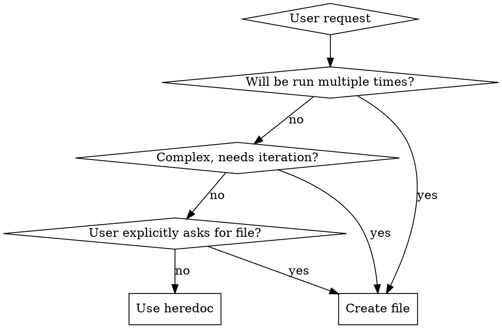
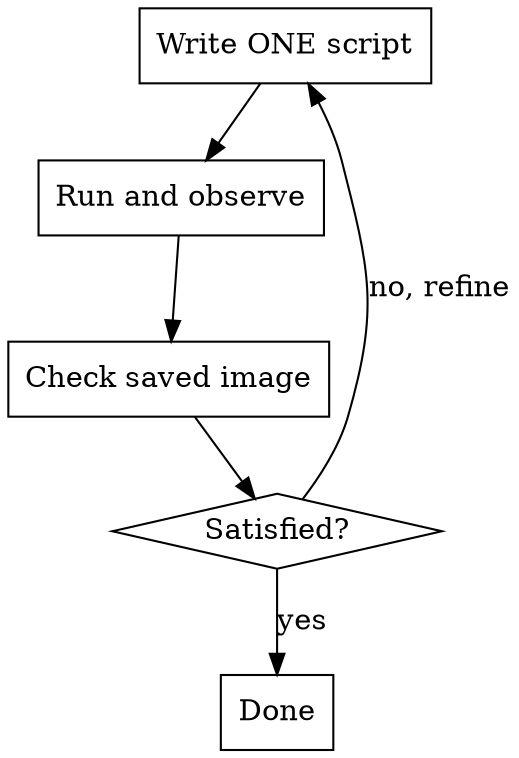

# Nano Banana

Quick Python scripting with Gemini image generation using uv heredocs. **No files needed for one-off tasks.**

## When to Use

**Use this skill when:**
- User requests image generation ("draw", "create", "generate image")
- User wants to edit existing images with AI
- User needs quick Python scripts with uv
- User mentions Gemini, Nano Banana, or AI art

**Don't use when:**
- User wants to analyze images (use vision models)
- User needs persistent/reusable scripts (then create files)
- User wants non-Gemini Python tasks

## Quick Reference

| Task | Pattern |
|------|---------|
| Generate image | `uv run - << 'EOF'` with inline script |
| Edit image | Same, but `contents=[prompt, img]` |
| Complex workflow | Multiple small scripts, evaluate between |
| Model choice | `NANO_BANANA_MODEL` (if set) > Pro (default) > Flash (if budget/fast) |
| Output format | Default: `webp`, or `NANO_BANANA_FORMAT` env var (webp/jpg/png) |
| Output location | `NNN-short-name/` (e.g., `001-cute-banana/`) |

## Core Pattern: Heredoc Scripts

**Default to heredoc for one-off tasks:**

```bash
uv run - << 'EOF'
# /// script
# dependencies = ["google-genai", "pillow"]
# ///
import os
import io
from pathlib import Path
from google import genai
from google.genai import types
from PIL import Image as PILImage

OUTPUT_DIR = Path("001-cute-banana")  # Format: NNN-short-name
OUTPUT_DIR.mkdir(exist_ok=True)

# Configuration from environment variables
model = os.environ.get("NANO_BANANA_MODEL")
if not model:
    # You (Claude) choose based on user context:
    # - gemini-3-pro-image-preview: default, high quality (recommended)
    # - gemini-2.5-flash-image: if user wants budget/fast/simple generation
    model = "gemini-3-pro-image-preview"  # <-- Replace based on user request

output_format = os.environ.get("NANO_BANANA_FORMAT", "webp").lower()
quality = int(os.environ.get("NANO_BANANA_QUALITY", "90"))

# Initialize client with optional custom endpoint
base_url = os.environ.get("GOOGLE_GEMINI_BASE_URL")
api_key = os.environ.get("GEMINI_API_KEY") or os.environ.get("GOOGLE_API_KEY")

if base_url:
    client = genai.Client(api_key=api_key, http_options={'base_url': base_url})
else:
    client = genai.Client(api_key=api_key)

response = client.models.generate_content(
    model=model,
    contents=["A cute banana character with sunglasses"],
    config=types.GenerateContentConfig(
        response_modalities=['IMAGE']
    )
)

for part in response.parts:
    if part.inline_data is not None:
        # Get google-genai Image object
        genai_image = part.as_image()

        # Convert to PIL Image from bytes
        pil_image = PILImage.open(io.BytesIO(genai_image.image_bytes))

        # Save with format conversion
        if output_format in ("jpg", "jpeg"):
            output_path = OUTPUT_DIR / "generated.jpg"
            pil_image.convert("RGB").save(output_path, "JPEG", quality=quality)
        elif output_format == "webp":
            output_path = OUTPUT_DIR / "generated.webp"
            pil_image.save(output_path, "WEBP", quality=quality)
        else:  # png (default fallback)
            output_path = OUTPUT_DIR / "generated.png"
            pil_image.save(output_path, "PNG")

        print(f"Saved: {output_path} ({output_format.upper()}, quality={quality})")
EOF
```

**Key points:**
- Use `google-genai` (NOT `google-generativeai`)
- Inline script metadata: `# /// script` block
- Required deps: `google-genai`, `pillow` (for `.as_image()` to get image bytes, then convert to PIL for saving)

## When to Create Files vs Heredoc



## Configuration

### Environment Variables

Customize plugin behavior with these environment variables:

| Variable | Default | Description |
|----------|---------|-------------|
| `NANO_BANANA_MODEL` | (Claude chooses: Pro or Flash) | Force specific model (overrides Claude's choice) |
| `NANO_BANANA_FORMAT` | `webp` | Output format: `webp`, `jpg`, or `png` |
| `NANO_BANANA_QUALITY` | `90` | Image quality (1-100) for webp/jpg |
| `GOOGLE_GEMINI_BASE_URL` | (official API) | Custom API endpoint (when using non-official deployment) |
| `GEMINI_API_KEY` | (falls back to `GOOGLE_API_KEY`) | API key (official or custom endpoint) |

**Official Google API (default):**
```bash
export GEMINI_API_KEY="your-api-key"  # Or GOOGLE_API_KEY (backward compatible)
# Model: Claude chooses Pro (default) or Flash (budget/fast) automatically
# Optional: force specific model
# export NANO_BANANA_MODEL="gemini-2.5-flash-image"
# Optional: change output format
# export NANO_BANANA_FORMAT="jpg"
```

**Custom Endpoint (e.g., self-hosted or proxy):**
```bash
export GOOGLE_GEMINI_BASE_URL="https://your-api.example.com/v1"
export GEMINI_API_KEY="your-custom-api-key"        # Custom endpoint key
export NANO_BANANA_MODEL="gemini-3-pro-image"      # Custom model name
export NANO_BANANA_FORMAT="webp"                   # WebP output
export NANO_BANANA_QUALITY="90"                    # High quality
```

**Note:** When `NANO_BANANA_MODEL` is set to a custom model, you typically also need to set `GOOGLE_GEMINI_BASE_URL` and `GEMINI_API_KEY` to match your custom deployment.

### Model Selection Priority

1. **If `NANO_BANANA_MODEL` is set**: ALWAYS use it (highest priority)
2. **Else, you (Claude) choose based on user request:**
   - **Default**: `gemini-3-pro-image-preview` (Nano Banana Pro) - recommended
   - **Switch to** `gemini-2.5-flash-image` when user:
     - Explicitly requests faster/simpler generation
     - Mentions budget/cost concerns
     - Asks for quick iterations

**Available models:**
- `gemini-3-pro-image-preview` - Professional, highest quality (Nano Banana Pro) ⭐ Default
- `gemini-2.5-flash-image` - Fast, general purpose, budget-friendly

## Output Directory Structure

Save images to numbered directories:

**Format:** `NNN-short-name/`
- **NNN**: Three-digit sequence (001, 002, 003...)
- **short-name**: kebab-case, 2-4 words from user request

**Examples:**
- "Generate user auth flow" → `001-user-auth-flow/`
- "Create cute cat" → `002-cute-cat/`
- "Make startup logo" → `003-startup-logo/`

**Session tracking:**
- First request: Create new directory with next number
- Same topic: Reuse same directory
- New topic: Create new directory with next number

```python
from pathlib import Path

OUTPUT_DIR = Path("001-example")  # You set this based on user request
OUTPUT_DIR.mkdir(exist_ok=True)

# Save images to OUTPUT_DIR (after converting from genai Image to PIL Image)
pil_image.save(OUTPUT_DIR / "output.png", "PNG")
```

## Workflow Loop for Complex Tasks

**Pattern:** Small scripts → Evaluate → Decide next



**Don't:**
- Create workflow orchestrators
- Build state management systems
- Write documentation files
- Auto-chain multiple steps

**Do:**
1. Run one heredoc script (generates/edits ONE image)
2. Check the output manually
3. Decide: done or refine?
4. If refine: run another small script

## Image Editing

Load existing image and include in request:

```bash
uv run - << 'EOF'
# /// script
# dependencies = ["google-genai", "pillow"]
# ///
import os
import io
from pathlib import Path
from google import genai
from google.genai import types
from PIL import Image as PILImage

OUTPUT_DIR = Path("002-party-hat")
OUTPUT_DIR.mkdir(exist_ok=True)

# Configuration from environment variables
model = os.environ.get("NANO_BANANA_MODEL")
if not model:
    # You (Claude) choose based on user context:
    # - gemini-3-pro-image-preview: default, high quality (recommended)
    # - gemini-2.5-flash-image: if user wants budget/fast/simple generation
    model = "gemini-3-pro-image-preview"  # <-- Replace based on user request

output_format = os.environ.get("NANO_BANANA_FORMAT", "webp").lower()
quality = int(os.environ.get("NANO_BANANA_QUALITY", "90"))

# Initialize client with optional custom endpoint
base_url = os.environ.get("GOOGLE_GEMINI_BASE_URL")
api_key = os.environ.get("GEMINI_API_KEY") or os.environ.get("GOOGLE_API_KEY")

if base_url:
    client = genai.Client(api_key=api_key, http_options={'base_url': base_url})
else:
    client = genai.Client(api_key=api_key)

# Load existing image
img = PILImage.open("001-cute-banana/generated.webp")

response = client.models.generate_content(
    model=model,
    contents=[
        "Add a party hat to this character",
        img  # Pass PIL Image directly
    ],
    config=types.GenerateContentConfig(
        response_modalities=['IMAGE']
    )
)

for part in response.parts:
    if part.inline_data is not None:
        # Get google-genai Image object
        genai_image = part.as_image()

        # Convert to PIL Image from bytes
        pil_image = PILImage.open(io.BytesIO(genai_image.image_bytes))

        # Save with format conversion
        if output_format in ("jpg", "jpeg"):
            output_path = OUTPUT_DIR / "edited.jpg"
            pil_image.convert("RGB").save(output_path, "JPEG", quality=quality)
        elif output_format == "webp":
            output_path = OUTPUT_DIR / "edited.webp"
            pil_image.save(output_path, "WEBP", quality=quality)
        else:  # png
            output_path = OUTPUT_DIR / "edited.png"
            pil_image.save(output_path, "PNG")

        print(f"Saved: {output_path}")
EOF
```

## Image Configuration

Aspect ratio and resolution:

```python
config=types.GenerateContentConfig(
    response_modalities=['IMAGE'],
    image_config=types.ImageConfig(
        aspect_ratio="16:9",  # "1:1", "16:9", "9:16", "4:3", "3:4"
        image_size="2K"       # "1K", "2K", "4K" (UPPERCASE required)
    )
)
```

## Red Flags - STOP and Use Heredoc

If you're thinking any of these thoughts, you're over-engineering:
- "This might be reused later"
- "Let me create proper structure"
- "I'll document this for reference"
- "Let me build a workflow system"
- "I should make this configurable"
- "This is complex, I need proper files"

**All of these mean: Use heredoc. It's a one-off task.**

## Common Mistakes

| Mistake | Fix |
|---------|-----|
| Creating permanent `.py` files for one-off tasks | Use heredoc instead |
| Using `google-generativeai` (old API) | Use `google-genai` (new API) |
| Using `gemini-2.0-flash` or wrong model | Use `gemini-3-pro-image-preview` or `gemini-2.5-flash-image` |
| Saving to flat files (`output.png`) | Use `NNN-short-name/` directories |
| Hardcoding PNG format | Use format conversion with `NANO_BANANA_FORMAT` (default: webp) |
| Creating workflow orchestrators | Write small scripts, iterate manually |
| Using PIL to draw/edit images | Use Gemini API with `contents=[prompt, img]` |
| Writing documentation for simple tasks | Just run scripts and print status |
| Auto-chaining multiple steps | Run one step, evaluate, decide next |

## Debugging

1. Print `response.parts` to see what was returned
2. Check `GEMINI_API_KEY` or `GOOGLE_API_KEY` is set
3. For edits: verify image file exists and is valid
4. Try simpler prompt to isolate issues

## Advanced Usage

For complex workflows (thinking process, Google Search grounding, multi-turn conversations), load `references/guide.md`.
