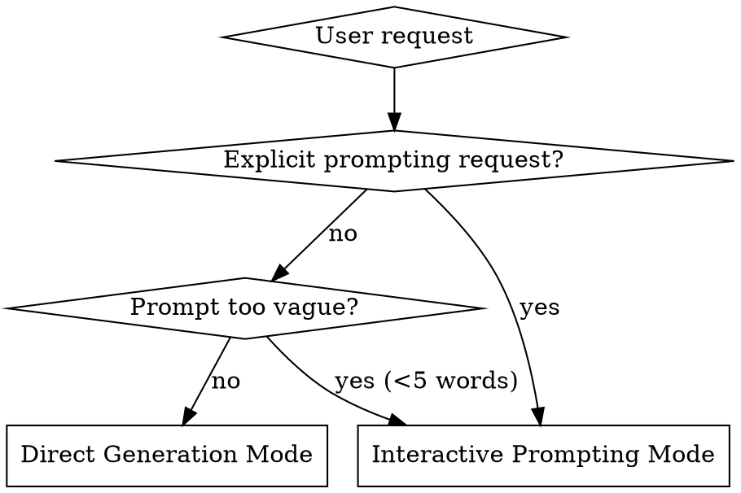
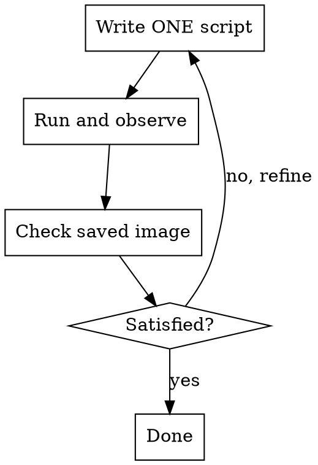
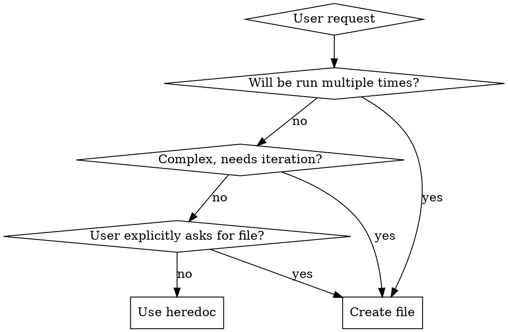

# Nano Banana

Quick Python scripting with Gemini image generation using uv heredocs. **No files needed for one-off tasks.**

Supports two modes:
- **Direct Generation**: Run immediately with user's prompt
- **Interactive Prompting**: Guide user through prompt design with proven techniques

## When to Use



**Use this skill when:**
- User requests image generation ("draw", "create", "generate image")
- User wants to create slides, presentations, or infographics
- User wants to edit existing images with AI
- User asks for prompt help ("write a prompt", "help me craft", "improve my prompt")
- User mentions brand style ("use style trend", "with trend colors")
- User mentions NotebookLM-style slides or specific visual styles
- User needs quick Python scripts with uv

**Don't use when:**
- User wants to analyze images (use vision models)
- User needs persistent/reusable scripts (then create files)
- User wants non-Gemini Python tasks

## Style Detection

Check user's message for style specifications:

**Structured syntax:**
- `style: "trend"` → Trend Micro brand colors
- `style: "notebooklm"` or `style: "slide"` → NotebookLM presentation style
- `style: "custom"` → Ask for custom color preferences

**Natural language:**
- "use style trend" → Apply Trend Micro brand
- "with trend colors" → Apply Trend Micro brand
- "notebooklm style" or "create slide" or "presentation style" → NotebookLM aesthetic
- "custom style: blue #0066cc" → Parse custom colors

**Style precedence:**
1. Inline specification (structured or natural language)
2. Ask user during prompting (if in Interactive Mode)
3. No style applied (default)

## Quick Reference

### Direct Generation Mode

| Task | Pattern |
|------|---------|
| Generate image | `uv run - << 'EOF'` with inline script |
| Edit image | Same, but `contents=[prompt, img]` |
| Complex workflow | Multiple small scripts, evaluate between |
| Model choice | `NANO_BANANA_MODEL` (if set) > Pro (default) > Flash (if budget/fast) |
| Output format | Default: `webp`, or `NANO_BANANA_FORMAT` env var (webp/jpg/png) |
| Output location | `NNN-short-name/` (e.g., `001-cute-banana/`) |

### Interactive Prompting Mode

| Step | Action |
|------|--------|
| 1. Gather | Check for reference images, style specs |
| 2. Clarify | Ask 2-4 questions about output type, subject, style |
| 3. Select Technique | Choose from 16+ patterns (see references/guide.md) |
| 4. Generate Prompt | Apply technique, brand style, aspect ratio |
| 5. Present | Show prompt with explanation and variations |
| 6. Execute | Generate image with crafted prompt |

## Mode Selection

**Enter Interactive Prompting Mode when:**
- User explicitly requests: "help me write a prompt", "craft a better prompt"
- Prompt is too vague: <5 words, missing key details
- User says "improve this prompt: ..."

**Use Direct Generation Mode when:**
- User provides detailed prompt (>5 words with specifics)
- User just wants quick generation: "draw a cat"
- Prompt already includes style specs

## Direct Generation Mode

### Core Pattern: Heredoc Scripts

**Default to heredoc for one-off tasks:**

```bash
uv run - << 'EOF'
# /// script
# dependencies = ["google-genai", "pillow"]
# ///
import os
import io
from pathlib import Path
from google import genai
from google.genai import types
from PIL import Image as PILImage

OUTPUT_DIR = Path("001-cute-banana")  # Format: NNN-short-name
OUTPUT_DIR.mkdir(exist_ok=True)

# Configuration from environment variables
model = os.environ.get("NANO_BANANA_MODEL")
if not model:
    # You (Claude) choose based on user context:
    # - gemini-3-pro-image-preview: default, high quality (recommended)
    # - gemini-2.5-flash-image: if user wants budget/fast/simple generation
    model = "gemini-3-pro-image-preview"  # <-- Replace based on user request

output_format = os.environ.get("NANO_BANANA_FORMAT", "webp").lower()
quality = int(os.environ.get("NANO_BANANA_QUALITY", "90"))

# Detect if lossless format is needed (for diagrams/slides)
use_lossless = False

# You (Claude) should understand user's intent and set use_lossless accordingly:
# 1. Slide deck styles → True (automatic)
#    - style: trend or style: notebooklm
# 2. User requests lossless/highest quality (any language) → True
#    - English: "lossless", "highest quality", "no compression"
#    - 繁中: "無損", "最高品質"
#    - 簡中: "无损", "最高质量"
#    - 日文: "ロスレス", "最高品質"
#    - Or intent: "I need perfect quality for printing"
# 3. User requests lossy/smaller file (any language) → False
#    - English: "lossy", "compress more", "smaller file"
#    - 繁中: "有損", "壓縮", "檔案小一點"
#    - Any language expression meaning smaller/compressed
# 4. Default for photos/general images → False

# Understand intent, not keyword matching

# Initialize client with optional custom endpoint
base_url = os.environ.get("GOOGLE_GEMINI_BASE_URL")
api_key = os.environ.get("GEMINI_API_KEY") or os.environ.get("GOOGLE_API_KEY")

if base_url:
    client = genai.Client(api_key=api_key, http_options={'base_url': base_url})
else:
    client = genai.Client(api_key=api_key)

response = client.models.generate_content(
    model=model,
    contents=["A cute banana character with sunglasses"],
    config=types.GenerateContentConfig(
        response_modalities=['IMAGE']
    )
)

for part in response.parts:
    if part.inline_data is not None:
        # Get google-genai Image object
        genai_image = part.as_image()

        # Convert to PIL Image from bytes
        pil_image = PILImage.open(io.BytesIO(genai_image.image_bytes))

        # Save with format conversion
        if output_format in ("jpg", "jpeg"):
            output_path = OUTPUT_DIR / "generated.jpg"
            pil_image.convert("RGB").save(output_path, "JPEG", quality=quality)
        elif output_format == "webp":
            output_path = OUTPUT_DIR / "generated.webp"
            if use_lossless:
                # Lossless WebP for slide decks (VP8L encoding)
                # Saves 20-30% vs PNG, zero quality loss (vs lossy: saves 95% but blurs)
                pil_image.save(output_path, "WEBP", lossless=True)
                print(f"Saved: {output_path} (WEBP lossless, optimized for slides)")
            else:
                # Lossy WebP for photos (VP8 encoding)
                pil_image.save(output_path, "WEBP", quality=quality)
                print(f"Saved: {output_path} (WEBP, quality={quality})")
        else:  # png (default fallback)
            output_path = OUTPUT_DIR / "generated.png"
            pil_image.save(output_path, "PNG")
            print(f"Saved: {output_path} (PNG)")
EOF
```

**Key points:**
- Use `google-genai` (NOT `google-generativeai`)
- Inline script metadata: `# /// script` block
- Required deps: `google-genai`, `pillow` (for `.as_image()` to get image bytes, then convert to PIL for saving)

### Output Directory Naming

Save images to numbered directories:

**Format:** `NNN-short-name/`
- **NNN**: Three-digit sequence (001, 002, 003...)
- **short-name**: kebab-case, 2-4 words from user request

**Examples:**
- "Generate user auth flow" → `001-user-auth-flow/`
- "Create cute cat" → `002-cute-cat/`
- "Make startup logo" → `003-startup-logo/`

**Session tracking:**
- First request: Create new directory with next number
- Same topic: Reuse same directory
- New topic: Create new directory with next number

### Configuration

Customize plugin behavior with environment variables:

| Variable | Default | Description |
|----------|---------|-------------|
| `NANO_BANANA_MODEL` | (Claude chooses: Pro or Flash) | Force specific model (overrides Claude's choice) |
| `NANO_BANANA_FORMAT` | `webp` | Output format: `webp`, `jpg`, or `png` |
| `NANO_BANANA_QUALITY` | `90` | Image quality (1-100) for webp/jpg |
| `GOOGLE_GEMINI_BASE_URL` | (official API) | Custom API endpoint (for non-official deployments) |
| `GEMINI_API_KEY` | (falls back to `GOOGLE_API_KEY`) | API key (official or custom endpoint) |

### Image Editing

Load existing image and include in request:

```bash
uv run - << 'EOF'
# /// script
# dependencies = ["google-genai", "pillow"]
# ///
import os
import io
from pathlib import Path
from google import genai
from google.genai import types
from PIL import Image as PILImage

OUTPUT_DIR = Path("002-party-hat")
OUTPUT_DIR.mkdir(exist_ok=True)

# Configuration from environment variables
model = os.environ.get("NANO_BANANA_MODEL")
if not model:
    model = "gemini-3-pro-image-preview"

output_format = os.environ.get("NANO_BANANA_FORMAT", "webp").lower()
quality = int(os.environ.get("NANO_BANANA_QUALITY", "90"))

# Initialize client
base_url = os.environ.get("GOOGLE_GEMINI_BASE_URL")
api_key = os.environ.get("GEMINI_API_KEY") or os.environ.get("GOOGLE_API_KEY")

if base_url:
    client = genai.Client(api_key=api_key, http_options={'base_url': base_url})
else:
    client = genai.Client(api_key=api_key)

# Load existing image
img = PILImage.open("001-cute-banana/generated.webp")

response = client.models.generate_content(
    model=model,
    contents=[
        "Add a party hat to this character",
        img  # Pass PIL Image directly
    ],
    config=types.GenerateContentConfig(
        response_modalities=['IMAGE']
    )
)

for part in response.parts:
    if part.inline_data is not None:
        genai_image = part.as_image()
        pil_image = PILImage.open(io.BytesIO(genai_image.image_bytes))

        if output_format in ("jpg", "jpeg"):
            output_path = OUTPUT_DIR / "edited.jpg"
            pil_image.convert("RGB").save(output_path, "JPEG", quality=quality)
        elif output_format == "webp":
            output_path = OUTPUT_DIR / "edited.webp"
            pil_image.save(output_path, "WEBP", quality=quality)
        else:  # png
            output_path = OUTPUT_DIR / "edited.png"
            pil_image.save(output_path, "PNG")

        print(f"Saved: {output_path}")
EOF
```

### Image Configuration

Aspect ratio and resolution:

```python
config=types.GenerateContentConfig(
    response_modalities=['IMAGE'],
    image_config=types.ImageConfig(
        aspect_ratio="16:9",  # "1:1", "16:9", "9:16", "4:3", "3:4"
        image_size="2K"       # "1K", "2K", "4K" (UPPERCASE required)
    )
)
```

### Workflow Loop for Complex Tasks

**Pattern:** Small scripts → Evaluate → Decide next



**Don't:**
- Create workflow orchestrators
- Build state management systems
- Write documentation files
- Auto-chain multiple steps

**Do:**
1. Run one heredoc script (generates/edits ONE image)
2. Check the output manually
3. Decide: done or refine?
4. If refine: run another small script

### Red Flags - STOP and Use Heredoc

If you're thinking any of these thoughts, you're over-engineering:
- "This might be reused later"
- "Let me create proper structure"
- "I'll document this for reference"
- "Let me build a workflow system"
- "I should make this configurable"
- "This is complex, I need proper files"

**All of these mean: Use heredoc. It's a one-off task.**

## Interactive Prompting Mode

### Workflow

**Step 1: Gather Reference Materials and Detect Style**

Before asking questions, check if the user has provided:
- **Reference images** - Photos for character consistency, style, composition
- **Existing prompts** - Previous attempts to improve
- **Visual references** - Screenshots or examples of desired output
- **Inline style specification** - `style: "trend"` or "use style trend"

**Style Detection:**
- If `style: "trend"` (case-insensitive) → Set brand_style = "trend"
- If "use style trend" or "with trend colors" → Set brand_style = "trend"
- If `style: "custom"` → Set brand_style = "custom"
- Otherwise → brand_style = None (will ask in Step 2)

**Step 2: Clarify Intent with Questions**

Use `AskUserQuestion` tool to understand user's goal. Ask 2-4 questions:

**Core Questions (always ask):**
1. **Output Type**: Photo/realistic, Illustration, Infographic, Product shot, UI mockup
2. **Subject**: Person, Object/product, Scene/environment, Concept/abstract
3. **Brand Style** (skip if detected in Step 1): None/Custom, Trend Micro

**Technique-Specific Questions (conditional):**
- **If Photo/Realistic**: Era? Camera style? Lighting?
- **If Reference Images**: Role for each image? Preserve character identity?
- **If Text Needed**: What text? Font style? Placement?
- **If Educational/Infographic**: Concept? Audience? Labels/arrows?

**Step 3: Determine Prompt Style**

Based on user responses, select technique from `references/guide.md`:

| User Need | Recommended Style |
|-----------|-------------------|
| Simple, quick generation | Narrative Prompt (Technique 1) |
| Precise control over details | Structured Prompt (Technique 2) |
| Era-specific aesthetic | Vibe Library + Photography Terms (Techniques 3-4) |
| Magazine/poster with text | Physical Object Framing (Technique 5) |
| Conceptual/interpretive | Perspective Framing (Technique 6) |
| Diagram/infographic | Educational Imagery (Technique 7) |
| Editing existing image | Image Transformation (Technique 8) |
| Multiple views/panels | Multi-Panel Output (Technique 9) |
| Multiple reference images | Reference Role Assignment (Technique 12) |

**Step 4: Generate the Prompt**

1. Load `references/guide.md` to access technique details
2. Apply relevant techniques based on Step 3
3. Include negative prompts if needed (Technique 10)
4. Specify aspect ratio/resolution if required (Technique 11)
5. Apply brand style if selected (load `references/brand-styles.md`)

**Brand Style Integration:**

If user selected **Trend Micro brand style** or **NotebookLM style**:
1. Load `references/brand-styles.md` (for Trend) or `references/slide-deck-styles.md` (for NotebookLM) for complete specifications
2. **Use lossless WebP format** (both styles are for slide decks with pure colors, text, and icons):
   ```python
   # Override format settings for slide deck styles (or if user requests lossless)
   # Understand user intent in any language - not just keyword matching
   use_lossless = True  # Set to True for slide styles or explicit user request
   pil_image.save(output_path, "WEBP", lossless=True)
   # VP8L encoding: saves 20-30% vs PNG with zero quality loss
   # (Lossy WebP saves 95% but blurs text - not suitable for slides)
   ```
3. **Automatically apply NotebookLM slide aesthetic**:
   - Polished, well-structured tech infographic aesthetic
   - Clean slide-level organization with logical flow
   - Professional but accessible design
   - Clear visual hierarchy
   - Minimal text, maximum visual communication
   - Icons and simple illustrations over complex graphics
   - Style reference: Similar to Google's product documentation or modern tech blog infographics
4. If Trend style, append Trend brand color guidelines to the prompt:
   - **Primary**: Trend Red (#d71920) as hero/accent color
   - **Guardian Red** (#6f0000) for intensity
   - **Grays** (#58595b to #e6e7e8) for backgrounds, neutrals
   - **Black and White** for contrast
   - **Additional**: Dark Blue (#005295) or Teal (#2cafa4) only if needed
5. Add: "Keep the design clean and professional with clear intent in color usage. Suitable for 16:9 presentation format."

**Step 5: Present and Iterate**

Present to user:
1. **The prompt** - Ready to use
2. **Technique explanation** - Why this structure was chosen
3. **Variation suggestions** - Alternative approaches to try

Offer to refine based on feedback.

**Step 6: Generate the Image**

Execute with the crafted prompt using Direct Generation Mode pattern above.

**Important**: Set `use_lossless = True` in the generation script when:
- Style is Trend or NotebookLM (slide deck styles), OR
- User explicitly requests lossless/highest quality (understand intent in any language)

This will:
- Use VP8L (lossless WebP) encoding instead of VP8 (lossy)
- Save 20-30% file size compared to PNG (typical for diagrams/slides)
- Perfect for slides with text, icons, and graphics - zero quality loss
- Much better than lossy (lossy saves 95% but blurs text)

## When to Create Files vs Heredoc



## Debugging

1. Print `response.parts` to see what was returned
2. Check `GEMINI_API_KEY` or `GOOGLE_API_KEY` is set
3. For edits: verify image file exists and is valid
4. Try simpler prompt to isolate issues

## Common Mistakes

| Mistake | Fix |
|---------|-----|
| Creating permanent `.py` files for one-off tasks | Use heredoc instead |
| Using `google-generativeai` (old API) | Use `google-genai` (new API) |
| Using wrong model names | Use `gemini-3-pro-image-preview` or `gemini-2.5-flash-image` |
| Saving to flat files (`output.png`) | Use `NNN-short-name/` directories |
| Hardcoding PNG format | Use format conversion with `NANO_BANANA_FORMAT` (default: webp) |
| Creating workflow orchestrators | Write small scripts, iterate manually |
| Not detecting inline style specs | Check for both `style:` syntax and natural language mentions |
| Skipping prompting when user asks for help | Enter Interactive Mode when user says "help", "craft", "improve" |
| Using PIL to draw/edit images | Use Gemini API with `contents=[prompt, img]` |
| Writing documentation for simple tasks | Just run scripts and print status |
| Auto-chaining multiple steps | Run one step, evaluate, decide next |

## Advanced Usage

For complex workflows (thinking process, Google Search grounding, multi-turn conversations), see `references/guide.md`.

For complete prompting techniques (16 techniques with examples), see `references/guide.md`.

For brand style specifications, see `references/brand-styles.md`.

For slide deck and presentation styles (NotebookLM aesthetic, infographics, data viz), see `references/slide-deck-styles.md`.
